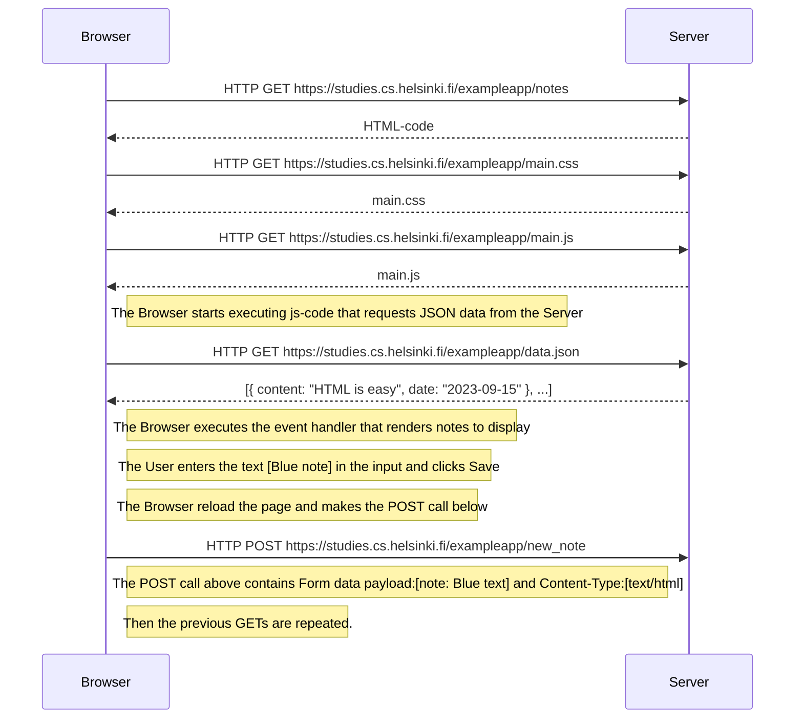

```mermaid
sequenceDiagram
    participant Browser

    participant Server

    Browser->>Server: HTTP GET https://studies.cs.helsinki.fi/exampleapp/notes

    Server-->>Browser: HTML-code

    Browser->>Server: HTTP GET https://studies.cs.helsinki.fi/exampleapp/main.css

    Server-->>Browser: main.css

    Browser->>Server: HTTP GET https://studies.cs.helsinki.fi/exampleapp/main.js

    Server-->>Browser: main.js

    Note right of Browser: The Browser starts executing js-code that requests JSON data from the Server

    Browser->>Server: HTTP GET https://studies.cs.helsinki.fi/exampleapp/data.json

    Server-->>Browser: [{ content: "HTML is easy", date: "2023-09-15" }, ...]

    Note right of Browser: The Browser executes the event handler that renders notes to display

    Note right of Browser: The User enters the text [Blue note] in the input and clicks Save

    Note right of Browser: The Browser reload the page and makes the POST call below

    Browser->>Server: HTTP POST https://studies.cs.helsinki.fi/exampleapp/new_note

    Note right of Browser: The POST call above contains Form data payload:[note: Blue text] and Content-Type:[text/html]

    Note right of Browser: Then the previous GETs are repeated.


```

<!-- https://mermaid.js.org/syntax/sequenceDiagram.html -->